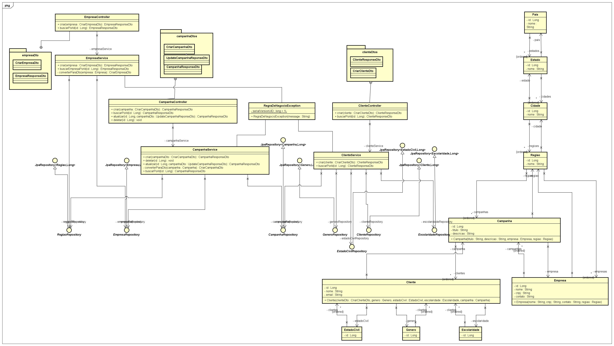
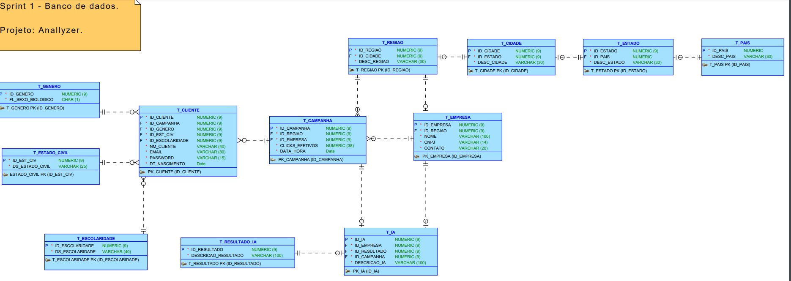

# Anallyzer 📈
Bem-vindo ao repositório do Anallyzer, um projeto focado em análise de e-mail marketing na área de ecommerce. 

<h1 id="autores">🤝 Integrantes</h2>
<table>
  <tr>
    <td align="center">
      <p>Mobile</p>
      <a href="https://github.com/nichol6s">
        <br>
        <sub>
          <strong>Nicholas Santos</strong>
        </sub>
      </a>
    </td>
    <td align="center">
      <p>IA</p>
      <a href="https://github.com/VitorKubica">
        <br>
        <sub>
          <strong>Vitor Kubica</strong>
        </sub>
      </a>
    </td>
    <td align="center">
      <p>Database & C#</p>
      <a href="https://github.com/DuduViolante">
        <br>
        <sub>
          <strong>Eduardo Violante</strong>
        </sub>
      </a>
    </td>
    <td align="center">
      <p>Java</p>
      <a href="https://github.com/k-alm">
        <br>
        <sub>
          <strong>Kauan de Almeida</strong>
        </sub>
      </a>
    </td>
    <td align="center">
        <p>DevOps & Compliance</p>
        <a href="https://github.com/biasvestka">
        <br>
        <sub>
            <strong>Beatriz Svestka</strong>
        </sub>
      </a>
    </td>
  </tr>
</table>

## 🚀 Iniciando o projeto
```sh
#Clone o repositorio
$ git clone https://github.com/k-alm/Challenge-Java

#Clique com o botão direito na classe ApiAnallyzerApplication
#Run as -> Java Application
```
## 📊 Diagrama de Classes

## 🛢️ Modelo de Banco de Dados

## 🔗 Link do pitch:
- https://youtu.be/73gU17oIHiY

## 🛑 Listagem dos endpoints: 
Lembrando que a rota padrão começa com <b>"/anallyzer"</b>

| Endpoints         | Método | Ação                                                    |
|-------------------|--------|---------------------------------------------------------|
| /campanha{id}     | GET    | Retorna a campanha selecionada pelo o {id}              |
| /clientes/{id}    | GET    | Retorna o cliente selecionado pelo o id {id}            |
| /empresas/{id}    | GET    | Retorna a empresa selecionada pelo o {id}               |
| /campanha         | POST   | Cria uma nova campanha                                  |
| /clientes         | POST   | Cria um novo cliente                                    |
| /empresas         | POST   | Cria uma nova empresa                                   |
| /campanha/{id}    | PATCH  | Altera nome e descrição da campanha                     |
| /campanha/{id}    | DELETE | Deleta uma campanha                                     |
